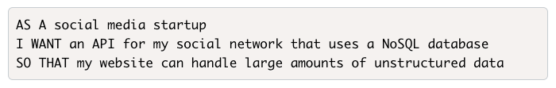

# Friendly Feelings

## Description

This is an API that allows for CRUD operations to be performed for users interacting on a social media platform. Created for the Butler Coding Boot Camp using Express.js, NoSQL, and MongoDB.

## Table of Contents

  * [User Story](#user)  
  * [Installation](#installation)
  * [Usage](#usage)
  * [Walkthrough](#walkthrough)
  * [Questions](#questions)

## User Story

## Installation

1. Clone the repository to your machine
2. Open your CLI and navigate to the root of the application
3. Run `npm i` or `npm install` to install the needed packages (Express and Mongoose)
4. Use the command `npm start` to load the server

## Usage

With the server loaded you can use Insomnia Core or another application that can handle the API requests. 

## Walkthrough 

Use [this](https://drive.google.com/file/d/11G13rODcVSgYpGVjV0apOfHmqZt20CK7/view?usp=sharing) video for a breakdown of the steps above and an example of the tests for the routes.

## Questions

  If you have questions about this project please contact me at [crawleyj2@gmail.com](mailto:crawleyj2@gmail.com).
  More of my work can be found on GitHub at [crawleyj2](https://github.com/crawleyj2)